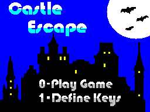

# Castle Escape - An IrataHack Production
A ZX Spectrum game written for [FUSE](https://en.wikipedia.org/wiki/Fuse_(emulator)) (but should work on a real ZX Spectrum 128K) using [Z88DK](https://en.wikipedia.org/wiki/Z88DK).

## Credits
* Coding - [Iratahack](mailto:iratahack@digitalxfer.com)
* Graphics - Supported by [Carnivac](https://zxart.ee/eng/authors/c/carnivac/)
* Sound - Curtesy of [ayfx_improved](https://github.com/Threetwosevensixseven/ayfxedit-improved)
* Levels - Designed with [Tiled](https://www.mapeditor.org/)

## Synopsis
Wee Knight must escape the haunted castle collecting gold coins and dodging the castles deadly inhabitants as he goes. Due to the enormous weight of his armor, Wee Knight cannot jump very high unless he consumes the purple eggs found within the castle. But beware, the anti-gravity effects of the eggs do not last long leaving Wee Knight at risk of missing out on the castles many treasures. Prolong life by collecting the hearts and don’t let Wee Knight fall too far or he'll be crushed by the weight of his own armor.

## User Controls
* Keys
  * O - Left
  * P - Right
  * SPACE - Jump
* Joysticks
  * Kempston

## Building
Easy, run _make_ from the _src_ directory. The latest version of Z88DK must be in the path.

### Make Targets
* clean - remove all derived files
* all - build executable (.tap file)
* dis - build and disassemble
* run - build and run with fuse.exe which must be on the path

## Game Images

