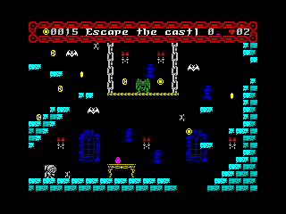
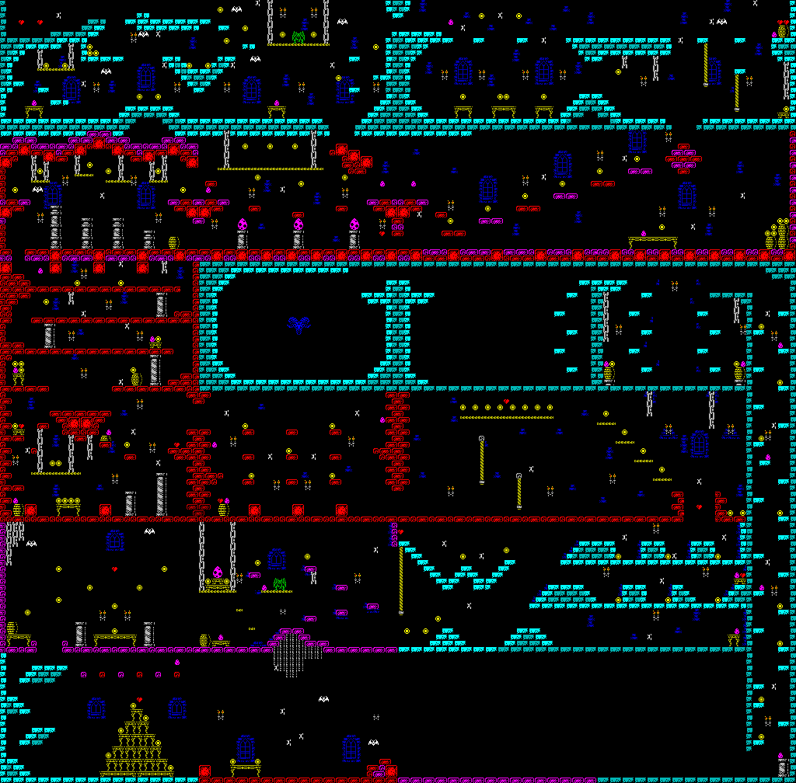

# Castle Escape - An IrataHack Production
A ZX Spectrum game written using [Z88DK](https://github.com/z88dk/z88dk) for [FUSE](http://fuse-emulator.sourceforge.net) (but should work on a real ZX Spectrum 128K).

## Credits
* Coding - [IrataHack](mailto:iratahack@digitalxfer.com)
* Graphics - Supported by [Carnivac](https://zxart.ee/eng/authors/c/carnivac/)
* Music - Borrowed from [WYZTracker](https://github.com/AugustoRuiz/WYZTracker)
* Sound Effects - Created using [WYZTracker](https://github.com/AugustoRuiz/WYZTracker)
* Levels - Designed with [Tiled](https://www.mapeditor.org/)
* PNG to SCR - Converted with [PNG-to-SCR](https://github.com/MatejJan/PNG-to-SCR) 

## Synopsis
Wee Knight must escape the haunted castle collecting gold coins and dodging the castles deadly inhabitants as he goes. Due to the enormous weight of his armor, Wee Knight cannot jump very high unless he consumes the purple eggs found within the castle. But beware, the anti-gravity effects of the eggs do not last long leaving Wee Knight at risk of missing out on the castles many treasures. Prolong life by collecting the hearts and don’t let Wee Knight fall too far or he'll be crushed by the weight of his own armor.

## User Controls
* Default Keys (can be redefined)
  * O - Left
  * P - Right
  * SPACE - Jump
* Joysticks
  * Kempston

## Latest Release
The latest release can be downloaded from [here](https://github.com/iratahack/CastleEscape/releases/tag/latest) as a *.tap* file. Remember to switch FUSE into 128K mode as this is a 128K game.

## Game Images
The larger images include the ZX Spectrum border, smaller images do not.

### Screen$


### Main Menu


### In-game Play



### Level Map
The game consists 24 levels arranged in a 4x6 grid.



## Building Sources
The latest version of Z88DK must be in the path including *z88dk-asmpp.pl* (pre-processor)
and *z88dk-asmstyle.pl* (assembly code formatter). Install Z88DK on Ubuntu with the commands
below or on another OS by following the instructions [here](https://github.com/z88dk/z88dk/wiki/installation).

```
sudo snap install --edge z88dk
sudo snap alias z88dk.zcc zcc
sudo snap alias z88dk.z88dk-asmpp z88dk-asmpp
sudo snap alias z88dk.z88dk-asmstyle z88dk-asmstyle
export Z88DK=/snap/z88dk/current/share/z88dk
export ZCCCFG=${Z88DK}/lib/config
export PATH=/snap/z88dk/current/bin:$PATH
```

From the cloned repo use the following commands to build the game.

```
make -C assets install
make -C src all
```

The result of the build should be a *CastleEscape.tap* (tape image file) in the *src* directory which can be loaded and executed with FUSE.

### Make Targets

* assets Directory
  * clean - remove all derived files
  * all - build the asset files
  * install - Copy the asset files to the src directory
* src Directory
  * clean - remove all derived files
  * all - build game *CastleEscape.tap* file
  * dis - build and disassemble
  * run - build and run with FUSE which must be on the path
