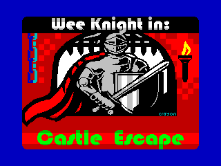
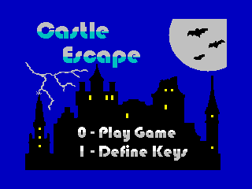
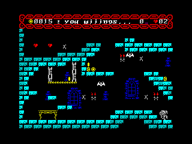

# Castle Escape - An IrataHack Production

A ZX Spectrum game written using [Z88DK](https://github.com/z88dk/z88dk) and [FUSE](http://fuse-emulator.sourceforge.net) (but should work on a real ZX Spectrum 128K, +2, +3 or ZX Spectrum Next. You can find a ZX Spectrum Next emulator [here](https://github.com/chernandezba/zesarux)).

## Credits

* Sprites & Tiles - Supported by [Carnivac](https://zxart.ee/eng/authors/c/carnivac/)
* Tile & Sprite conversion - [Headkaze](https://github.com/headkaze/Gfx2Next)
* Tape & Disk Loaders - Courtesy of [Tom Dalby](https://tomdalby.com/) ([ZXSTLC](https://tomdalby.com/other/zxstlc.html))
* screen$ and menu art - Created by [crayon](https://github.com/jardafis)
  * Converted to .scr with [PNG-to-SCR](https://github.com/MatejJan/PNG-to-SCR)
* Torment font - by [DamienG](https://damieng.com/typography/zx-origins/)
* Coding - [IrataHack](mailto:iratahack@digitalxfer.com)
* Levels - Designed with [Tiled](https://www.mapeditor.org/) by [IrataHack](mailto:iratahack@digitalxfer.com)
* Music - Borrowed from [WYZTracker](https://github.com/AugustoRuiz/WYZTracker)
* Sound Effects - Created using [WYZTracker](https://github.com/AugustoRuiz/WYZTracker)

## Synopsis

Wee Knight must escape the haunted castle collecting gold coins and dodging the castles deadly inhabitants as he goes. Due to the enormous weight of his armor, Wee Knight cannot jump very high unless he consumes the purple eggs found within the castle. But beware, the anti-gravity effects of the eggs do not last long leaving Wee Knight at risk of missing out on the castles many treasures. Prolong life by collecting the hearts and don’t let Wee Knight fall too far or he'll be crushed by the weight of his own armor.

## User Controls

* Default Keys (can be redefined)
  * O - Left
  * P - Right
  * SPACE - Jump
* Joysticks
  * Kempston

## Latest Release

The latest release can be downloaded from [here](https://github.com/iratahack/CastleEscape/releases/tag/latest) as a *.tap* file. Remember to switch FUSE into 128K mode as this is a 128K game.

## Game Images

 

### In-game Play

 

### Level Map

The game consists 24 levels, shown below.


## Building Sources

The latest version of Z88DK must be in the path. Install Z88DK from the Snap Store with the commands
below or by following the instructions [here](https://github.com/z88dk/z88dk).

```sh
sudo snap install --edge z88dk

sudo snap alias z88dk.zcc zcc
sudo snap alias z88dk.z88dk-z80asm z88dk-z80asm
sudo snap alias z88dk.z88dk-asmstyle z88dk-asmstyle
sudo snap alias z88dk.z88dk-dis z88dk-dis
sudo snap alias z88dk.z88dk-zx0 z88dk-zx0
```

From the cloned repo use the commands below to build and run the game.

```sh
cd src
make run
```

The result of the build should be a *CastleEscape.tap* (tape image) file in the *src* directory which can be loaded and executed with a ZX Spectrum emulator.

### Make Targets

The *Makefile* supports building for both the **ZX Spectrum 128K** and the **ZX Spectrum Next**. To select the *Next* build, add `TARGET=+zxn` to the make command line when using any of the *src* directory make targets below.

* *assets* Directory
  * clean - remove all derived files
  * all - build the asset files
  * install - Copy the asset files to the src directory
* *src* Directory
  * clean - remove all derived files
  * all - build *CastleEscape.tap* file
  * dis - build and disassemble
    * Add 'BANK=<bankname>' to disassemble a specific bank, the default is BANK_2
  * run - build a .tap image and run it
  * rundsk - build a .dsk image (+3 disk image) and run it (not supported on ZX Spectrum Next)
